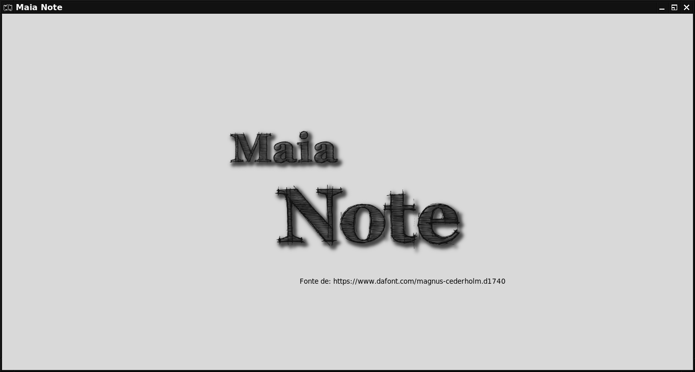
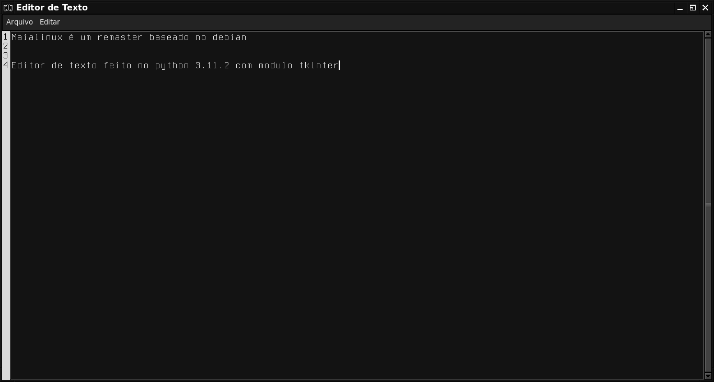
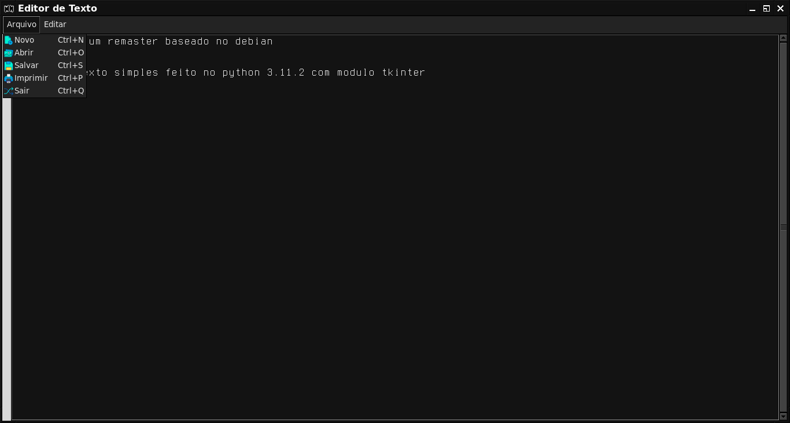

# Maia-Note
## Editor de texto simples feito no python 3.11.2, utilizando o módulo tkinter

  

  

 

### Apenas um projeto para quem quiser se aventurar ou implementar.

 

  
## Imagens do Maia Note 
 

 

 

  

## Coisas que faltam fazer:

  
### - Correção da visualização dos números
### - Implementar a função Imprimir
### - Corregir bugs que venham a surgir.

  

### Para executar o Maia Note, execute a arquivo main.py com o seguinte comando:
### python main.py

 
